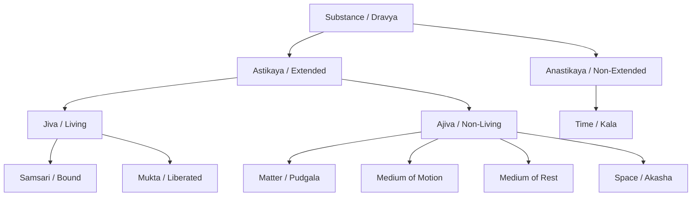
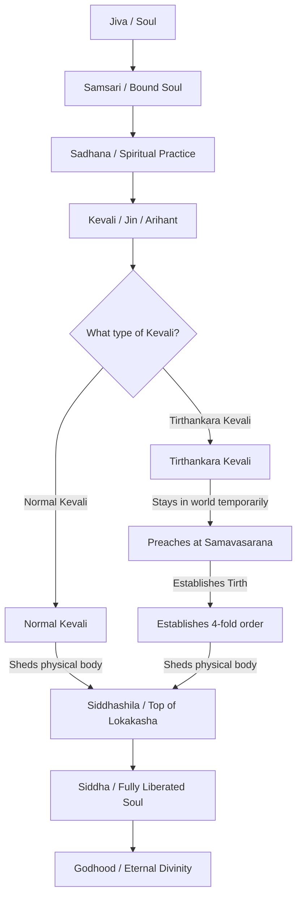

# Jain Philosophy

> [!info] Jain Philosophy chapters
> [[C2. Tirthankaras List|24 Tirthankaras]] · [[C3. Sacred Places of Jainism|Sacred Places]] · [[C4. નવકાર મહામંત્ર, આચારાંગ અને આવશ્યક સૂત્ર|Navkar Mantra and Jain Sutras]]

Jainism is one of the ancient, heterodox (*Nastika*) schools of Indian philosophy. It is called heterodox because it rejects the authority of the Vedas and God as the creator. However, unlike Charvaka, it strongly believes in the existence of the soul (*Jiva*), karma, rebirth, and liberation (*Moksha*).

---

## 1. Introduction and Origin

* **Meaning of Jaina:** The word is derived from *Ji* (જિ), which means "to conquer." A Jaina is a conqueror of their own passions (anger, ego, deceit, and greed).
* **Tirthankaras:** Jainism is not founded by a single person. It is revealed by 24 spiritual teachers known as *Tirthankaras* (ford-makers who bridge the river of worldly life).
  * The 1st Tirthankara was **Rishabhadeva**.
  * The 23rd Tirthankara was **Parshvanatha**.
  * The 24th and last Tirthankara was **Vardhamana Mahavira** (6th Century BCE), a contemporary of Buddha.

---

## 2. Epistemology: Theory of Knowledge (*Pramana-shastra*)

Jain epistemology is unique because it classifies knowledge based on how the soul acquires it.

### A. Classification of Knowledge
Knowledge is divided into two main categories:
1. **Paroksha (Indirect):** Knowledge acquired through external aids like the senses and the mind.
2. **Aparoksha (Direct):** Knowledge perceived by the soul directly, without the help of senses or the mind. *(Note: This is the opposite of how Western and Nyaya philosophy define direct/indirect).*

Under these two, there are **Five Types of Knowledge**:
* **Mati-jnana (Indirect):** Knowledge gained through sense perception and mental thinking.
  * **Pramana Connection:** Corresponds to **Samvyavaharika Pratyaksha** (empirical/practical perception—technically indirect for the soul but direct for everyday life) and **Anumana** (Inference).
  * **Four Stages of Sensory Perception:**
    1. **Avagraha (અવગ્રહ / अवग्रह - Sensation):** Vague, first awareness resulting from contact between sense organs and the object.
    2. **Iha (ઈહા / ईहा - Speculation/Willingness):** The mental striving/willingness to clear doubts and identify the object (e.g., *"Is that a post or a human?"*).
    3. **Avaya (અવાય / अवाय - Determination):** The final removal of doubt and identification of the object (e.g., *"It is definitely a human"*).
    4. **Dharana (ધારણા / धारणा - Retention):** Retaining the determined knowledge in memory for future reference.
* **Shruta-jnana (Indirect):** Knowledge gained from signs, symbols, words, or reading scriptures.
  * **Pramana Connection:** Corresponds to **Shabda Pramana** (verbal testimony / scriptural authority).

* **Avadhi-jnana (Direct):** Clairvoyance. Direct knowledge of distant physical objects in space and time.
* **Manahparyaya-jnana (Direct):** Telepathy. Direct knowledge of the thoughts and minds of others.
* **Kevala-jnana (Direct):** Omniscience. Infinite, absolute, and all-comprehensive knowledge of everything in the universe. This is possessed only by liberated souls (*Kevalins*).

---

### B. The Theories of Relativity
Because human knowledge is limited (except for *Kevala-jnana*), Jainism introduces three critical doctrines to explain the nature of truth and reality:

#### 1. Anekantavada (Doctrine of Non-Absolutism / Manifoldness of Reality)
* **Core Idea:** Reality has infinite aspects and characteristics — **"Anantadharmakam Vastu"** (અનંતધર્માત્મકં વસ્તુ / अनन्तधर्मात्मकं वस्तु). 
* **The Problem:** Ordinary humans look at reality from **only one standpoint** at a time and mistake it for the complete truth.
* **Example:** The famous parable of the **Blind Men and the Elephant**. Each blind man touches a different part (leg, trunk, tail) and claims the elephant is like a pillar, branch, or rope. They are all partially correct but completely wrong about the whole elephant.
* **Significance:** It promotes intellectual tolerance and teaches that no single view has a monopoly on the absolute trut h.
* **"Eko bhāvah sarvathā yena dṛṣṭah, sarve bhāvāḥ sarvathā tena dṛṣṭāḥ"** (એકો ભાવઃ સર્વથા યેન દ્રષ્ટઃ, સર્વે ભાવાઃ સર્વથા તેન દ્રષ્ટઃ / एको भावः सर्वथा येन दृष्टः, सर्वे भावाः सर्वथा तेन दृष्टः):
  * *Meaning:* *"He who has known one object in all its aspects, has known all objects; and he who has known all objects in all their aspects, has known one object."*
  * *Significance:* Because everything in the universe is interconnected (by cause, space, time, and negation), you cannot fully know a single object without knowing its relation to all other things. Only an omniscient being (*Kevalin*) possesses this absolute knowledge.

#### 2. Syadvada (Doctrine of Relativity of Judgments)
* **Core Idea:** Since reality is manifold, all human assertions are relative, conditional, and limited.
* **The Method:** Every statement must be prefixed with the word **"Syat"** (સ્યાત્), which means *"in some respect,"* *"perhaps,"* or *"somehow."*
* **The Seven-Fold Judgment (*Saptabhangi-naya*):**
  1. *Syad-asti:* In some respect, a thing exists (e.g., the clay pot is red in the room now).
  2. *Syad-nasti:* In some respect, a thing does not exist (e.g., the pot is not blue, and not outside the room).
  3. *Syad-asti-nasti:* In some respect, it exists and does not exist.
  4. *Syad-avaktavyam:* In some respect, it is inexpressible/indescribable (if we try to say it exists and doesn't exist at the same time).
  5. *Syad-asti-avaktavyam:* In some respect, it exists and is inexpressible.
  6. *Syad-nasti-avaktavyam:* In some respect, it does not exist and is inexpressible.
  7. *Syad-asti-nasti-avaktavyam:* In some respect, it exists, does not exist, and is inexpressible.

#### 3. Nayavada (Doctrine of Standpoints)
* **Core Idea:** A *Naya* is a particular point of view or perspective from which we judge a thing. 
* **Main Standpoints:**
  * **Dravyarthika-naya:** Looking at the substance or permanence of things (e.g., gold stays gold).
  * **Paryayarthika-naya:** Looking at the changing forms or modes of things (e.g., gold changing into a ring, then a necklace).

---

## 3. Metaphysics: Theory of Reality (*Tattva-shastra*)

Jain metaphysics is characterized as **Realistic Pluralism** (reality is real, objective, and made of many substances).

### A. Concept of Substance (*Dravya*)
* **Definition:** A substance is defined as that which possesses both qualities and modes — **"Guna-paryayavat dravyam"** (ગુણપર્યાયવત્ દ્રવ્યમ્ / गुणपर्यायवत् द्रव्यम्).
* **Conception of Reality (Sat):** 
  * **"Utpada-vyaya-dhrauvya-yuktam sat"** (ઉત્પાદ-વ્યય-ધ્રૌવ્ય-યુક્તં સત્ / उत्पाद-व्यय-ध्रौव्य-युक्तं सत्) – Reality is characterized by **origination** (creation/उत्पाद), **destruction** (decay/व्यय), and **permanence** (continuity/ध्रौव्य). This shows that change and permanence coexist in a substance.
* A substance has two aspects:
  * **Gunas (Qualities):** These are essential, permanent, and unchanging attributes of a substance. They are **eternal (Nitya / નિત્ય)** (e.g., consciousness is the nitya guna of the soul).
  * **Paryayas (Modes):** These are accidental, temporary, and changing forms/modifications that a substance undergoes. They are **non-eternal / temporary (Anitya / અનિત્ય)** (e.g., joy, sorrow, childhood, or old age are anitya modes of the soul).
  * **Sva-paryaya & Para-paryaya (Self-modes vs. Other-modes):**
    * A substance is defined by what it is (**Sva-paryaya** / own characteristics) and also by what it is not (**Para-paryaya** / characteristics of other things).
    * E.g., a gold ring exists as gold, in a specific place, at a specific time, and as a ring (*Sva-paryaya*). But it also does NOT exist as a clay pot, at another place, or another time (*Para-paryaya*). Both are essential to define its unique identity. If we deny *Para-paryaya*, everything would become everything else, destroying all identities.

---

### B. Classification of Substances (Dravya)

Substances (*Dravya*) are strictly classified based on their extension in space:

1. **Astikaya** (અસ્તિકાય - Extended/having body): Substances that occupy space and have multiple parts (*Pradeshas*). 
   * This is further divided into:
     * **Jiva** (Living/conscious soul)
     * **Ajiva** (Non-living/unconscious substance), which includes:
       * *Pudgala* (Matter)
       * *Dharma* (Medium of motion)
       * *Adharma* (Medium of rest)
       * *Akasha* (Space)
2. **Anastikaya** (અનસ્તિકાય - Non-extended/bodyless): Substance that does not occupy space and is *Eka-pradeshi* (has only one point).
   * This consists **only** of **Kala** (Time).

#### 1. Jiva (The Soul)
* **Essence:** Consciousness (*Chetena*) and knowledge (*Upayoga*) are the primary qualities of Jiva.
* **Pure State:** In its pure, unbound state, every soul possesses **Ananta Chatushtaya** (Four Infinite Qualities):
    1. Infinite Knowledge (*Ananta Jnana*)
    2. Infinite Perception (*Ananta Darshana*)
    3. Infinite Power (*Ananta Virya*)
    4. Infinite Bliss (*Ananta Sukha*)
* **Body Size (Deha-parimana):** Unlike other schools, Jainism believes the soul is dynamic and expands or contracts to fit the size of the body it occupies (like light from a lamp filling a small cup or a large room).
* **Types of Jivas:** 
  * *Samsari* (worldly, bound by karma).
  * *Mukta* (liberated from cycle of birth and death).

#### 2. Ajiva (Non-Living Substances)
* **Pudgala (Matter):** Composed of atoms (*Anu*). It can be felt, tasted, smelled, and seen.
* **Dharma (Medium of Motion):** The principle that helps things move (like water helping a fish to swim).
* **Adharma (Medium of Rest):** The principle that helps things stay at rest (like shade helping a tired traveler to sit).
* **Akasha (Space):** Provides room for all substances to exist.
* **Kala (Time):** The force behind change, age, and duration.

---

## 3.5. Concept of God & Tirthankara

Jainism is a **nontheistic** philosophy. It rejects the idea of a creator God (*Ishvara*) but firmly believes in **Godhood** (divinity/spiritual perfection).

### A. Rejection of a Creator God
Jainism gives several logical arguments against a creator God:
* **The Problem of Evil:** If the world was created by a perfect, benevolent God, why is there so much suffering and evil in the world?
* **No Desire for Creation:** If God is perfect, He should have no desires. Creation requires a desire or motive to create, which implies God was imperfect or incomplete before creation.
* **The Law of Karma:** The universe is self-regulated by the eternal, natural law of Karma. No divine governor is needed to award fruits of actions.

### B. What is "God" in Jainism?
* In Jainism, "God" is not a creator, but any soul (*Jiva*) that has completely liberated itself from the bondage of karma and achieved **Ananta Chatushtaya** (Infinite Knowledge, Perception, Power, and Bliss).
* Every liberated soul is a God (*Siddha*). Therefore, there is not one God, but **infinite Gods** in Jainism.

### C. Who is a Tirthankara?
* A **Tirthankara** (ford-maker) is a special liberated soul who, after achieving omniscience (*Kevala-jnana*), preaches the path to liberation and establishes the *Tirth* (the four-fold community of monks, nuns, laymen, and laywomen) to help others cross the ocean of transmigration.
* There are only **24 Tirthankaras** in each half-cycle of cosmic time.

### D. Difference: God (Siddha) vs. Tirthankara in Jainism

| Feature           | God (Siddha)                                                                                  | Tirthankara (Arihant/Jina)                                                                      |
| :---------------- | :-------------------------------------------------------------------------------------------- | :---------------------------------------------------------------------------------------------- |
| **Role**          | Enjoying eternal, silent bliss at the top of the universe (*Siddhashila*). They do not teach. | Actively teaches the path of liberation and establishes the *Tirth* for humanity.               |
| **Physical Body** | Bodyless (*Videhi*). Completely free from physical existence.                                 | Has a physical body (*Sadehi*) until they shed their final karmas and achieve complete Nirvana. |
| **Number**        | Infinite. Every liberated soul becomes a Siddha.                                              | Only 24 in each cosmic time cycle.                                                              |
| **Worship**       | Worshipped as the ultimate state of perfection.                                               | Worshipped as the supreme teachers and guides of humanity.                                      |

### E. The Flowchart of Soul's Liberation

Here is the step-by-step spiritual journey of a soul (*Jiva*) in Jainism:

> [!NOTE]
> * **Siddhashila** is located at the absolute top ceiling of **Lokakasha** (universe). The liberated soul cannot enter **Alokakasha** (empty space beyond the universe) because there is no *Dharma* (medium of motion) in Alokakasha to facilitate movement.
> * Therefore, both **Normal Kevalis** and **Tirthankara Kevalis** eventually shed their bodies and reach **Siddhashila**, staying there eternally as **Siddhas** (Gods).

---

## 4. Ethics: Bondage and Liberation (*Moksha*)

Jain ethics is highly practical, demanding strict self-discipline and moral conduct.

### A. The Concept of Karma and Bondage(બંધન)
* **Karma as Matter:** In Jainism, karma is not an invisible law, but actual **material particles** (*Pudgala*) that float in space.
* **How Bondage Happens:**
  1. When a soul acts out of passion (anger, ego, greed, deceit), it creates a sticky psychic state.
  2. This causes physical karma particles to flow toward the soul. This flow is called **Asrava** (influx / આશ્રવ).
  3. The karma particles stick to the soul, covering its infinite light. This sticking is called **Bandha** (bondage / બંધ).
 
---

### B. The Path to Liberation: Triratna (Three Jewels)
To get rid of karma and achieve liberation, a person must practice the *Triratna*:

1. **Samyak Darshana (Right Faith):** Respect and belief in the teachings of the Tirthankaras.
2. **Samyak Jnana (Right Knowledge):** True, error-free knowledge of the Jiva and Ajiva.
3. **Samyak Charitra (Right Conduct):** Living a moral life to stop fresh karma and destroy old karma.

---

### C. The Five Great Vows (*Pancha Mahavrata*)
Right Conduct requires practicing five vows. Monks practice them strictly (**Mahavratas**), while householders practice them in a milder form (**Anuvratas**):

1. **Ahimsa (Non-violence):** The core of Jain ethics (*Ahimsa Paramo Dharmah*). It means not harming any living being physically, verbally, or mentally.
2. **Satya (Truthfulness):** Speaking the truth pleasantly, avoiding harmful speech.
3. **Asteya (Non-stealing):** Not taking anything that is not given voluntarily.
4. **Brahmacharya (Chastity):** Complete celibacy for monks; fidelity to one's partner for householders.
5. **Aparigraha (Non-possession / Non-attachment):** Complete renunciation of property and desires for monks; limiting possessions for householders.

---

### D. The Process of Liberation
The journey from bondage to absolute freedom (*Moksha*) involves seven steps (*Tattvas*):

1. **Jiva:** The conscious soul.
2. **Ajiva:** The material universe.
3. **Asrava:** Flow of karma particles to the soul due to passions.
4. **Bandha:** Sticking of karma particles to the soul.
5. **Samvara (Stopping / સંવર):** Stopping the fresh influx of karma through self-restraint and vows.
6. **Nirjara (Shedding / નિર્જરા):** Burning off and shedding the existing karma through penance, fasting, and meditation.
7. **Moksha (Liberation / મોક્ષ):** Complete freedom. Once all karma is shed, the soul rises to the top of the universe (*Siddhashila*) and experiences *Ananta Chatushtaya* eternally.

---

### E. Sallekhana (Santhara) – The Vow of Voluntary Fasting

**Sallekhana** (સલ્લેખના / संलेखना) is a highly respected spiritual vow in Jainism where a person voluntarily and gradually fasts to death.
* **Etymology:** Derived from two Sanskrit words: *Sat* (proper/good) and *Lekhana* (thinning/scrubbing). It means "the thinning of the physical body and passions (kashayas)" through self-discipline.
* **Santhara:** The term *Santhara* (સંથારા) is the Prakrit/Rajasthani word for the same practice, referring to the straw bed or mat on which the practitioner lies down during the final phase of the vow.

#### 1. Under What Circumstances is it Permitted?
Jainism does not allow this vow arbitrarily. It is permitted only under extreme conditions:
* Incurable terminal illness or failing health.
* Extreme old age where the body can no longer sustain spiritual practices.
* Unavoidable calamity or severe famine.

#### 2. Difference Between Sallekhana and Suicide (Atmaghata)
Jainism draws a sharp distinction between Sallekhana and suicide:

| Feature | Suicide (*Atmaghata*) | Sallekhana / Santhara |
| :--- | :--- | :--- |
| **State of Mind** | Driven by negative passions (anger, depression, frustration, fear). | Undertaken with a calm, peaceful, and meditative state of mind. |
| **Motive** | An escape from worldly pain or failure. | Spiritual purification, shedding karma (*Nirjara*), and achieving a peaceful death. |
| **Method** | Quick, violent, secret, and sudden. | Slow, gradual, public, under the guidance of a spiritual teacher (*Guru*). |
| **Karmic Effect** | Binds intense negative karma, leading to lower births. | Destroys past karma, leading to spiritual liberation or higher births. |

#### 3. Modern Legal Context
* **The Controversy:** In 2015, the Rajasthan High Court banned Santhara, comparing it to suicide under Section 309 of the IPC.
* **Supreme Court Verdict:** The Jain community argued that Santhara is a key part of their religious freedom (Article 25 of the Constitution). The Supreme Court of India subsequently stayed the High Court's ban, protecting the practice.

---

## 5. Critical Evaluation: Strengths and Limitations

### Strengths
* **Rationalism & Logic:** doctrines like *Anekantavada* and *Syadvada* show a highly scientific and open-minded approach to truth.
* **Non-violence:** Jainism raised the standard of *Ahimsa* to its highest peak, influencing figures like Mahatma Gandhi.
* **Democratic Spiritualism:** It teaches that anyone (not just a specific caste) can achieve liberation through self-effort. No divine grace is needed.

### Limitations / Criticisms
* **Extremism in Ahimsa:** Practicing *Ahimsa* so strictly (like sweeping the path, filtering water, avoiding farming to prevent killing insects) is difficult for ordinary people in daily life.
* **Soul in Matter:** The idea that even dust particles, wind, and water have souls (*Sthavara Jivas*) was criticized by other schools as unscientific.
* **Asceticism:** The emphasis on extreme physical torture and fasting unto death (*Sallekhana*) is viewed by critics as overly pessimistic and harsh.

---

## 6. Keywords

- Jiva & Ajiva
- Kevala-jnana
- Anekantavada
- Syadvada (*Syat*)
- Saptabhangi-naya
- Nayavada
- Asrava & Bandha
- Samvara & Nirjara
- Triratna
- Pancha Mahavrata
- Ahimsa
- Ananta Chatushtaya

---

## 7. Possible Questions

1. Explain the Jain doctrine of *Anekantavada* (Non-absolutism) and its logical relation to *Syadvada*.
2. Discuss the classification of substances (*Dravya*) in Jain metaphysics.
3. What is the Jaina theory of bondage and liberation? Discuss the steps of *Asrava*, *Bandha*, *Samvara*, and *Nirjara*.
4. Outline the five great vows (*Pancha Mahavrata*) of Jain ethics. How do *Anuvratas* differ from *Mahavratas*?
5. Critically evaluate the Jain theory of knowledge (*Epistemology*).
