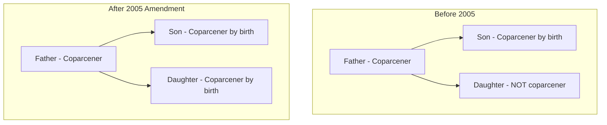
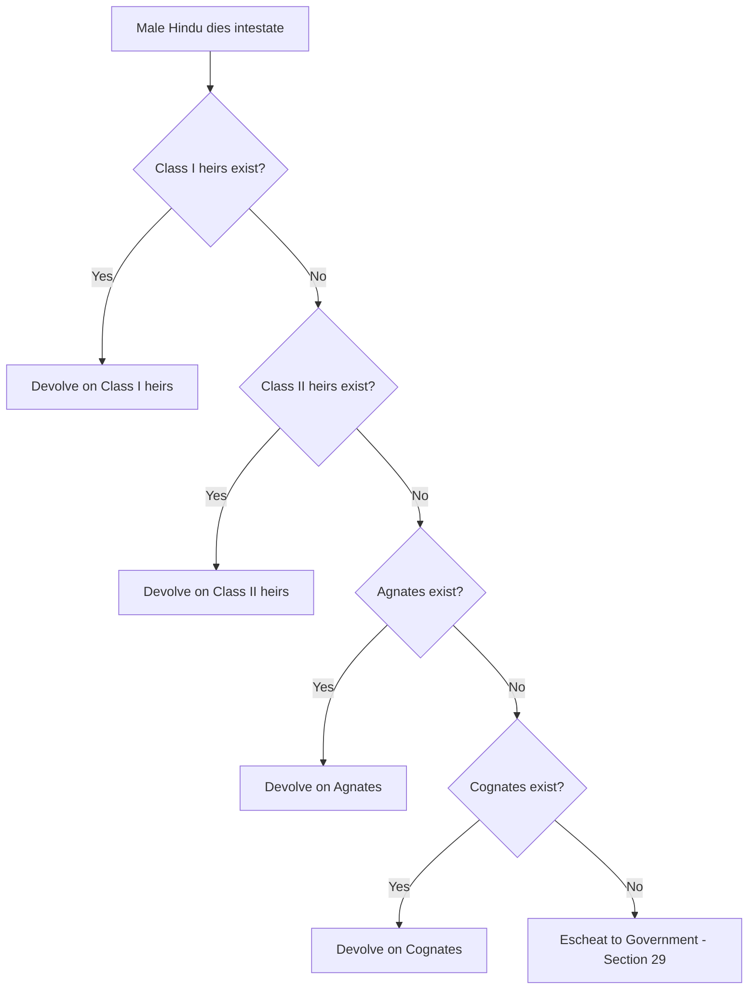

# Hindu Succession Act, 1956

The **Hindu Succession Act, 1956** (Act No. 30 of 1956) is one of the four **Hindu Code Bills** that modernised Hindu personal law after Independence. It **codifies and amends the law relating to intestate succession** (inheritance when a person dies **without a valid will**) among Hindus.

> **Intestate** = IN + TESTAMENT(વસિયતનામું) = died without a valid will (**વસિયતનામું કર્યા વગર મૃત્યુ પામ્યા**) => 
> **Testate** = TESTAMENT exists = died with a valid will (**માન્ય વસિયતનામું કરીને મૃત્યુ પામ્યા**) => 
> **Succession** = transfer of property after death (**મૃત્યુ પછી મિલકતની વારસાઈ**)

---

## At a Glance

| Item                            | Detail                                                                                   |
| ------------------------------- | ---------------------------------------------------------------------------------------- |
| **Enacted(ઘડાયેલ) by**          | Parliament of India                                                                      |
| **Date of enactment**           | 17 June 1956                                                                             |
| **Date of commencement(start)** | 17 June 1956                                                                             |
| **Territorial extent**          | Whole of India (Jammu & Kashmir included after J&K Reorganisation Act, 2019)             |
| **Parent legislation**          | Part of the **Hindu Code Bills**                                                         |
| **Major amendment**             | Hindu Succession (Amendment) Act, 2005 (Act 39 of 2005) — effective **9 September 2005** |
| **Chapters**                    | I (Preliminary), II (Intestate Succession), III (Testamentary Succession), IV (Repeals)  |
| **Total sections**              | 31 (originally; Sections 23, 24, 31 omitted after amendments)                            |

---

## 1. Historical Background

### 1.1 Before 1956 — Uncodified Hindu Law

Before this Act, Hindu inheritance was governed by:

- **Dharmaśāstra texts** (Manu, Yajnavalkya, etc.)
- **Commentaries** (Mitakshara, Dayabhaga schools)
- **Local customs and usages**

There was **no uniform national law**. Rules differed by:

- **Region** (Bengal vs Bombay vs Madras Presidency)
- **School of law** (Mitakshara vs Dayabhaga)
- **Caste and community custom**
- **Marumakkattayam / Aliyasantana** systems in Kerala and coastal regions

### 1.2 The Hindu Code Bills

Dr. **B.R. Ambedkar**, as Law Minister, drafted a comprehensive codification of Hindu personal law. The **Hindu Code Bills** included:

| Act                                       | Year | Subject                              |
| ----------------------------------------- | ---- | ------------------------------------ |
| Hindu Marriage Act, 1955                  | 1955 | Marriage, divorce, restitution(વળતર) |
| **Hindu Succession Act, 1956**            | 1956 | Inheritance                          |
| Hindu Minority and Guardianship Act, 1956 | 1956 | Guardianship of minors               |
| Hindu Adoptions and Maintenance Act, 1956 | 1956 | Adoption and maintenance             |

The Succession Act was passed after intense parliamentary debate. Conservatives resisted codification; reformers wanted gender equality. The 1956 Act was **progressive for its time** but still retained **male-centric coparcenary(સહભાગી) rules** until the **2005 Amendment**.

### 1.3 Why This Act Was Needed

- To bring **uniformity** in succession law across India
- To **replace conflicting customs** with clear statutory rules
- To give women **better inheritance rights** (though full equality came later)
- To align personal law with the **constitutional goal of equality** (Articles 14, 15)
- To reduce litigation(the process of taking legal action) caused by uncertain customary rules

---

## 2. Constitutional Context

The Act operates within India's constitutional framework:

| Constitutional provision | Relevance                                                                                           |
| ------------------------ | --------------------------------------------------------------------------------------------------- |
| **Article 14**           | Equality before law — basis for challenging discriminatory inheritance rules                        |
| **Article 15(1)**        | Prohibition of discrimination on grounds of sex                                                     |
| **Article 15(3)**        | State may make special provisions for women and children                                            |
| **Article 25**           | Freedom of religion — personal laws were initially kept outside reform pressure                     |
| **Article 44** (DPSP)    | Uniform Civil Code (UCC) — aspirational; Hindu Succession Act is partial codification, not full UCC |
| **Article 372**          | Continuance of pre-Constitution laws until altered by Parliament                                    |

**Important:** Personal laws are **not "laws in force" for Article 13** (as held in various cases), so they cannot be directly struck down for violating Fundamental Rights — but **statutory personal laws** (like this Act) **can** be challenged and amended by Parliament.

---

## 3. Applicability — Who Is Covered? (Section 2)

### 3.1 Persons to Whom the Act Applies

The Act applies to:

1. **Hindus** by religion in any form, including:
   - Virashaiva
   - Lingayat
   - Followers of Brahmo, Prarthana, or Arya Samaj
2. **Buddhists**
3. **Jains**
4. **Sikhs**
5. Any person **not** Muslim, Christian, Parsi, or Jew — **unless proved** they would not have been governed by Hindu law/custom for succession matters

### 3.2 Who Is Considered a Hindu (Explanation to Section 2)

| Category                                                   | Example                                      |
| ---------------------------------------------------------- | -------------------------------------------- |
| Legitimate/illegitimate child of two Hindu parents         | Child of Hindu father and Hindu mother       |
| Child of one Hindu parent, brought up in that community    | Child of Hindu mother raised in Hindu family |
| Convert or re-convert to Hinduism/Buddhism/Jainism/Sikhism | Person who returns to Hindu fold             |
|                                                            |                                              |

### 3.3 Exclusions

| Exclusion                                | Provision                                                                                      |
| ---------------------------------------- | ---------------------------------------------------------------------------------------------- |
| **Scheduled Tribes**                     | Section 2(2) — Act does **not apply** unless Central Government notifies by Official Gazette   |
| **Muslims, Christians, Parsis, Jews**    | Governed by their own personal laws (e.g., Muslim Personal Law / Indian Succession Act)        |
| **Property under Indian Succession Act** | Section 5(i) — e.g., property of persons married under Special Marriage Act, 1954 (Section 21) |

### 3.4 Territorial Extent (Section 1)

- Originally: whole of India **except Jammu & Kashmir**
- After **J&K Reorganisation Act, 2019**: extends to entire India

---

## 4. Key Definitions (Section 3)

| Term                                                 | Meaning                                                                                                                                  |
| ---------------------------------------------------- | ---------------------------------------------------------------------------------------------------------------------------------------- |
| **Agnate**(all links through males)                  | Related by blood/adoption **wholly through males**                                                                                       |
| **Cognate**(uterine blood)                           | Related by blood/adoption **not wholly through males**                                                                                   |
| **Heir**(linage)                                     | Any person, male or female, entitled to succeed to the property of an intestate under this Act                                           |
| **Intestate**                                        | Person who dies without a valid testamentary(વસિયતનામું) disposition                                                                     |
| **Custom / Usage**                                   | Rule continuously and uniformly observed for long time, having force of law — must be certain, reasonable, and not against public policy |
| **Full blood / Half blood / Uterine(ગર્ભાશય) blood** | Full = same father and mother; Half = same father, different mothers; Uterine = same mother, different fathers                           |
| **Marumakkattayam law**                              | Kerala matrilineal system (property through female line)                                                                                 |
| **Aliyasantana law**                                 | Karnataka/Kerala matrilineal system                                                                                                      |
| **Nambudri law**                                     | Special law for Nambudri Brahmins of Kerala                                                                                              |
|                                                      |                                                                                                                                          |

> **Note (Section 3(2)):** Masculine words in the Act **do not** automatically include females — unlike many general laws. This was changed in effect by the 2005 Amendment for coparcenary rights.

---

## 5. Overriding Effect (Section 4)

Section 4 gives the Act **primacy** over:

- Hindu law texts, rules, and interpretations
- Custom and usage
- Any other inconsistent law applicable to Hindus

**Result:** Where this Act makes provision, old Hindu law/custom on that point **ceases to apply**.

**Exception:** Section 4(2) was omitted in 2005 — originally it had a special provision regarding Kerala systems.

---

## 6. Properties Excluded from the Act (Section 5)

The Act does **not** apply to:

1. Property governed by **Indian Succession Act, 1925** (via Special Marriage Act, 1954)
2. Certain **princely state estates** descending to a single heir by covenant/agreement
3. **Valiamma Thampuran Kovilagam Estate** and Palace Fund (Cochin)

---

## 7. Core Concepts You Must Understand

### 7.1 Self-Acquired vs Ancestral Property

| Type                                 | Meaning                                                             | Succession                       |
| ------------------------------------ | ------------------------------------------------------------------- | -------------------------------- |
| **Self-acquired property**           | Property earned/purchased by a person himself                       | Devolves under Sections 8–16     |
| **Ancestral / Coparcenary property** | Property inherited up to 4 generations of male lineage (Mitakshara) | Governed mainly by **Section 6** |

### 7.2 Joint Hindu Family (JHF)

- A **family unit** recognised by Hindu law
- Has a **common ancestor** and **joint property**
- Managed by **Karta** (usually senior male)
- Members include **coparceners** and **members** (e.g., wives, unmarried daughters before 2005)

### 7.3 Coparcenary (Mitakshara Law)

- A narrower group within JHF
- Only **coparceners** had **birthright** in ancestral property
- Could demand **partition**
- Before 2005: **only males** (sons, grandsons, great-grandsons) were coparceners
- After 2005: **daughters also** are coparceners by birth

### 7.4 Mitakshara vs Dayabhaga Schools

| Feature             | Mitakshara (Majority of India)              | Dayabhaga (Mainly Bengal)                       |
| ------------------- | ------------------------------------------- | ----------------------------------------------- |
| Coparcenary         | Yes — sons get right by birth               | No coparcenary in same sense                    |
| Female inheritance  | Limited before reforms                      | Relatively better for women traditionally       |
| Devolution on death | Survivorship(ઉત્તરજીવિતા) among coparceners | Individual ownership; succession opens on death |
| Section 6 relevance | **Very important**                          | Less relevant (no Mitakshara coparcenary)       |
|                     |                                             |                                                 |

### 7.5 Strīdhana (Section 14)

Under old law, women often had **limited estate** (widow's estate — could use but not fully dispose).  
**Section 14** converted this into **absolute ownership** for female Hindus.

---

## 8. Section 6 — Coparcenary Property (Most Important Section)

This is the **heart of the Act** and the most examined topic in UPSC.

### 8.1 Position BEFORE 2005 Amendment

**Original Section 6:**

> When a male Hindu dies having an interest in Mitakshara coparcenary property, his interest devolves by **survivorship** upon surviving coparceners — **not** under general succession rules.

**Proviso (important):** If the deceased left a **Class I female heir** (widow, daughter, mother, etc.) or a male claiming through such female, his interest devolves by **testamentary/intestate succession** under the Act — **not survivorship**.

**Effect before 2005:**

- Daughters were **not coparceners** by birth
- They could get a share **only when a male coparcener died** and the proviso applied
- Sons had superior rights in ancestral property

### 8.2 Position AFTER 2005 Amendment (Current Law)

**Section 6(1) — Daughter as Coparcener:**

From 9 September 2005, in a Mitakshara JHF:

- Daughter of a coparcener becomes **coparcener by birth** — same as son
- Same **rights and liabilities** in coparcenary property
- Reference to "coparcener" includes **daughter**

**Section 6(2):**

- Property acquired by daughter as coparcener is held with **incidents of coparcenary ownership**
- She can dispose of it by **will (testamentary disposition)**

**Section 6(3) — Devolution on death:**

When a Hindu dies **after 9.9.2005**:

- His coparcenary interest devolves by **testamentary/intestate succession** — not survivorship
- Deemed partition before death
- **Daughter gets same share as son**
- Pre-deceased son/daughter's children get their parent's share

**Section 6(4) — Abolition of pious obligation:**

- No court shall enforce **pious obligation** of son/grandson/great-grandson to pay father's ancestral debt (for debts after 2005)
- Exception: debts contracted **before** 2005 amendment

**Section 6(5) — Partition cutoff:**

- Does not apply to partition effected **before 20 December 2004**
- "Partition" = **registered deed** or **court decree** (not oral/family arrangement)

### 8.3 Diagram — Coparcenary Before vs After 2005



---

## 9. Succession of a Male Hindu Dying Intestate (Sections 8–13)

### 9.1 General Order (Section 8)

Property of a **male Hindu** dying intestate devolves in this order:

1. **Class I heirs** (Schedule)
2. **Class II heirs** (Schedule) — only if no Class I heir
3. **Agnates** — if no Class I or II
4. **Cognates** — if no agnate
5. **Government (Escheat)** — Section 29, if no heir at all



### 9.2 Class I Heirs (Schedule)

All take **simultaneously** and **exclude** all other heirs:

| Heir                                                       |
| ---------------------------------------------------------- |
| Son                                                        |
| Daughter                                                   |
| Widow                                                      |
| Mother                                                     |
| Son of pre-deceased(મૃત) son                               |
| Daughter of pre-deceased son                               |
| Son of pre-deceased daughter                               |
| Daughter of pre-deceased daughter                          |
| Widow of pre-deceased son                                  |
| Son of pre-deceased son of pre-deceased son                |
| Daughter of pre-deceased son of pre-deceased son           |
| Widow of pre-deceased son of pre-deceased son              |
| Son of pre-deceased daughter of pre-deceased daughter      |
| Daughter of pre-deceased daughter of pre-deceased daughter |
| Daughter of pre-deceased son of pre-deceased daughter      |
| Daughter of pre-deceased daughter of pre-deceased son      |

### 9.3 Distribution Among Class I Heirs (Section 10)

| Rule       | Provision                                                                         |
| ---------- | --------------------------------------------------------------------------------- |
| **Rule 1** | Widow/widows together take **one share**                                          |
| **Rule 2** | Surviving **sons, daughters, and mother** each take **one share**                 |
| **Rule 3** | Heirs in branch of each **pre-deceased son/daughter** take **one share together** |
| **Rule 4** | That share divided per stirpes among branch members                               |

**Example:**

A dies leaving: widow W, son S1, son S2 (pre-deceased, leaving widow W2 and daughter D1), and mother M.

| Heir                   | Share            |
| ---------------------- | ---------------- |
| W (widow)              | 1 share          |
| M (mother)             | 1 share          |
| S1 (son)               | 1 share          |
| Branch of S2 (W2 + D1) | 1 share together |

Total = 4 shares.

### 9.4 Class II Heirs (Schedule) — 9 Entries

Class II heirs inherit **only if no Class I heir exists**. Within Class II, **entry-wise priority** applies:

| Entry | Heirs                                                                                                                      |
| ----- | -------------------------------------------------------------------------------------------------------------------------- |
| I     | Father                                                                                                                     |
| II    | (1) Son's daughter's son, (2) son's daughter's daughter, (3) brother, (4) sister                                           |
| III   | (1) Daughter's son's son, (2) daughter's son's daughter, (3) daughter's daughter's son, (4) daughter's daughter's daughter |
| IV    | (1) Brother's son, (2) sister's son, (3) brother's daughter, (4) sister's daughter                                         |
| V     | Father's father; father's mother                                                                                           |
| VI    | Father's widow; brother's widow                                                                                            |
| VII   | Father's brother; father's sister                                                                                          |
| VIII  | Mother's father; mother's mother                                                                                           |
| IX    | Mother's brother; mother's sister                                                                                          |

> Heirs in **Entry I** are preferred over Entry II, and so on. Heirs in the **same entry share equally**.

### 9.5 Agnates and Cognates (Sections 12–13)

When no Class I or II heirs exist:

| Term        | Rule                                                      |
| ----------- | --------------------------------------------------------- |
| **Agnate**  | Related through males only — e.g., father's brother's son |
| **Cognate** | Related but not wholly through males — e.g., sister's son |

**Order among agnates/cognates:**

1. Heir with **fewer degrees of ascent** preferred
2. If equal ascent, **fewer degrees of descent** preferred
3. If still tied, they take **simultaneously**

---

## 10. Female Hindu's Property — Absolute Ownership (Section 14)

**Revolutionary provision of 1956 Act:**

> Any property possessed by a female Hindu — before or after 1956 — is her **absolute property**, not limited estate.

Includes property acquired by:

- Inheritance, gift, partition, maintenance
- Own skill, purchase, prescription
- Strīdhana held before Act

**Exception (Section 14(2)):** Property given under **restricted estate** by will/gift/court order — then limited estate continues as prescribed.

---

## 11. Succession of a Female Hindu Dying Intestate (Sections 15–16)

### 11.1 General Order (Section 15)

| Priority | Heirs |
|----------|-------|
| **First** | Sons and daughters (including children of pre-deceased son/daughter) + **Husband** |
| **Second** | Heirs of the **husband** |
| **Third** | **Mother and father** |
| **Fourth** | Heirs of the **father** |
| **Last** | Heirs of the **mother** |

### 11.2 Special Rules (Section 15(2))

| Property source | Devolves upon (if no children) |
|-----------------|--------------------------------|
| Inherited from **father or mother** | Heirs of **father** — not general list |
| Inherited from **husband or father-in-law** | Heirs of **husband** — not general list |

**Kerala Amendment (2016):** Property inherited from **pre-deceased son** devolves upon **heirs of that pre-deceased son**.

### 11.3 Distribution Rules (Section 16)

- Heirs in earlier entry preferred over later entry
- Pre-deceased son/daughter's children take their parent's share
- For husband's/father's/mother's heirs — apply rules as if that person had died intestate

---

## 12. Special Provisions — Kerala Systems (Sections 7 & 17)

### Section 7 — Tarwad, Tavazhi, Kutumba, Kavaru, Illom

For Hindus governed by **Marumakkattayam** or **Aliyasantana** law:

- Interest in tarwad/tavazhi/illom/kutumba/kavaru devolves by **testamentary/intestate succession** under this Act
- **Not** by old matrilineal survivorship() rules

### Section 17

Modifies Sections 8, 10, 15 for persons who would have been governed by Marumakkattayam/Aliyasantana law.

---

## 13. General Provisions Relating to Succession (Sections 18–22)

| Section | Rule |
|---------|------|
| **18** | Full blood heirs preferred over half blood (if relationship otherwise same) |
| **19** | Multiple heirs take **per capita** as **tenants-in-common** (not joint tenants) |
| **20** | Child **in womb** at time of death inherits as if born before death |
| **21** | Simultaneous death — **younger presumed to survive elder** (if uncertain) |
| **22** | Class I co-heirs have **preferential right to purchase** when one co-heir wants to transfer immovable property/business |

---

## 14. Deleted Discriminatory Sections (Repealed by 2005 Amendment)

### Section 23 (Omitted) — Dwelling House Restriction

**Old rule:** In a dwelling house wholly occupied by joint family, **female heir** (except widow) could not claim partition if male heirs resided there — **unless** she was daughter who had no separate residence.

**Why deleted:** Discriminated against daughters and other female heirs in residence rights.

### Section 24 (Omitted) — Widow Remarriage Disqualification

**Old rule:** Certain widows (e.g., widow of pre-deceased son) **lost inheritance** if they remarried on or before succession opened.

**Why deleted:** Violated gender equality; remarriage should not disqualify inheritance.

---

## 15. Disqualifications (Sections 25–28)

| Section | Disqualification                                                                                                                                           |
| ------- | ---------------------------------------------------------------------------------------------------------------------------------------------------------- |
| **25**  | **Murderer** or abettor of murder — cannot inherit property of murdered person                                                                             |
| **26**  | **Convert's descendants** — children born after conversion disqualified from inheriting Hindu relatives' property (unless they remain Hindu at succession) |
| **27**  | Disqualified heir treated as having **pre-deceased** the intestate                                                                                         |
| **28**  | Disease, deformity, unchastity etc. **cannot** disqualify (unlike old Hindu law)                                                                           |

---

## 16. Escheat — Failure of Heirs (Section 29)

If no qualified heir exists:

- Property **devolves on the Government**
- Government takes it **subject to all obligations/liabilities** that would have bound a normal heir

---

## 17. Testamentary Succession (Section 30)

A Hindu may dispose of property by **will** according to the **Indian Succession Act, 1925**.

**Key points:**

- Applies to **self-acquired** and other disposable property
- After 2005: **Coparcenary interest** and daughter's coparcenary property also **can be willed**
- Will must comply with Indian Succession Act requirements (attestation, etc.)

> **Intestate** and **testamentary** succession are separate tracks. A valid will overrides intestate rules for the property it covers.

---

## 18. Hindu Succession (Amendment) Act, 2005 — Full Summary

| Change | Detail |
|--------|--------|
| **Section 6 substituted** | Daughters made coparceners by birth |
| **Section 4(2) omitted** | Simplified overriding effect |
| **Section 23 omitted** | Removed dwelling house discrimination |
| **Section 24 omitted** | Removed widow remarriage disqualification |
| **Section 30 Explanation amended** | Female can dispose coparcenary interest by will |
| **Section 31 repealed** | Old repeals clause removed |
| **Effective date** | 9 September 2005 |
| **Cut-off for partition** | 20 December 2004 |

### State Amendments (Before Central 2005 Amendment)

Some states amended earlier:

| State              | Year | Key change                                     |
| ------------------ | ---- | ---------------------------------------------- |
| **Kerala**         | 1976 | Equal rights to women in joint family property |
| **Andhra Pradesh** | 1986 | Daughters as coparceners                       |
| **Tamil Nadu**     | 1989 | Daughters as coparceners                       |
| **Maharashtra**    | 1994 | Daughters as coparceners                       |
| **Karnataka**      | 1994 | Sections 6A, 6B, 6C inserted                   |

These state laws were **precursors** to the central 2005 reform.

---

## 19. Landmark Supreme Court Judgments

### 19.1 *Prakash v. Phulavati* (2016)

- Held: 2005 amendment **not fully retrospective**
- If coparcener **died before 9.9.2005**, pending disputes — limited application
- Created confusion on daughter's rights

### 19.2 *Danamma @ Suman Surpur v. Amar* (2018)

- Held: If **father was coparcener**, daughter could inherit even if father died **before 2005**
- Daughter's coparcener status depends on **father's coparcenary status**, not father's survival on amendment date

### 19.3 *Vineeta Sharma v. Rakesh Sharma* (2020) — **Landmark**

**Supreme Court held:**

- Section 6(1) is **retroactive** in effect — daughter becomes coparcener **by birth**
- **Father need not be alive** on 9.9.2005
- Partition must be **registered deed or court decree** — oral partitions not valid under Section 6(5)
- Resolved conflict between *Prakash* and *Danamma*
- **Daughters have equal coparcenary rights** as a matter of constitutional morality and gender justice

> For exams: **Vineeta Sharma (2020)** is the **current authoritative position**.

### What _Prakash v. Phulavati_ said

The 2005 amendment made daughters **coparceners by birth**, like sons.

But _Prakash v. Phulavati_ interpreted it this way:

> For a daughter to claim the benefit of amended Section 6, **both the daughter and her father/coparcener had to be alive on 9 September 2005**.

Example:

```
Father ── Daughter
   |
Father dies in 2003

Amendment starts: 9 Sept 2005
```

According to _**Prakash**_:

```
Father died before 9-9-2005
        ↓
2005 amended Section 6
would NOT apply
        ↓
Daughter could not claim
coparcenary right under new Section 6
```

So even if a property dispute or partition case was still pending in court in 2005, the daughter could not say:

> “The new law has now come, so give me equal coparcenary rights.”

The Court treated the amendment as **prospective**, requiring the father/coparcener to have been alive when the amendment commenced.

### Why did this create confusion?

Because another Supreme Court case, **_Danamma v. Amar_ (2018)**, gave daughters coparcenary rights even though their father had died in **2001**, before the 2005 amendment. That appeared inconsistent with _Prakash_.

So there were effectively conflicting signals:

```
Prakash v. Phulavati (2016)
Father must be alive on 9-9-2005
                ↓
            Daughter gets right

Danamma (2018)
Father died before 2005
                ↓
Daughters still received benefit
```

### Then _Vineeta Sharma_ (2020) settled it

The Supreme Court finally said:

> **The father/coparcener does NOT need to be alive on 9 September 2005.**

A daughter's coparcenary status arises **by birth**, just like a son's. The Court specifically rejected the “living daughter of a living coparcener” requirement laid down in _Prakash_.

So today:

```
Daughter born before 2005 ✅
Father died before 2005 ✅ possible
Daughter alive on 9-9-2005
        ↓
She can have coparcenary rights
subject to statutory protections
for earlier partitions/dispositions.
```

### So improve your note

Your current line:

> If coparcener died before 9.9.2005, pending disputes — limited application

is a little unclear.

Write this instead:

> **Prakash v. Phulavati (2016):** Held that amended Section 6 applied only where **both daughter and father/coparcener were alive on 9 September 2005**. Thus, if the father had died before the amendment, the daughter could not claim coparcenary rights under amended Section 6.  
> **This view was later overruled by Vineeta Sharma (2020).**

For exams, remember:

> **Prakash = Father must be alive ❌ old view**  
> **Vineeta Sharma = Father need not be alive ✅ present law**

That one contrast is enough to remember the entire case.

---

## 20. Comparison With Other Personal Laws

| Feature                    | Hindu Succession Act            | Muslim Personal Law                                  | Indian Succession Act (Christians/Parsis) |
| -------------------------- | ------------------------------- | ---------------------------------------------------- | ----------------------------------------- |
| Codified by Parliament     | Yes (1956)                      | Partially / largely uncodified                       | Yes (1925)                                |
| Daughter's ancestral right | Equal after 2005                | Generally half of son's share (Quranic rules)        | Equal for Christians                      |
| Will allowed               | Yes (Section 30)                | Yes (within limits — max 1/3 without heirs' consent) | Yes                                       |
| Coparcenary concept        | Yes (Mitakshara)                | No                                                   | No                                        |
| Applicability              | Hindus, Sikhs, Jains, Buddhists | Muslims                                              | Christians, Parsis, Jews                  |

---

## 21. Current Debates and Criticisms

1. **Scheduled Tribes exclusion** — Act does not apply unless notified; tribal women may lack protection
2. **Oral partitions** — Families claim old oral partitions to deny daughters' rights
3. **Implementation gap** — Social practice lags behind legal reform in rural areas
4. **Stepchildren and illegitimate children** — Limited recognition; inequality persists
5. **UCC debate** — Act is partial codification; full Uniform Civil Code remains politically contested (Article 44)
6. **Judicial review petitions** — Recent challenges to certain provisions on constitutional grounds
7. **Source-back rule** — Supreme Court has noted property inherited from maternal/paternal line may return to source family if no direct heirs — preserves lineage logic

---

## 22. Section-Wise Quick Reference

| Section | Topic |
|---------|-------|
| 1 | Short title and extent |
| 2 | Application |
| 3 | Definitions |
| 4 | Overriding effect |
| 5 | Excluded properties |
| 6 | Coparcenary property |
| 7 | Tarwad/tavazhi/kutumba/kavaru/illom |
| 8 | Male intestate succession — general rules |
| 9 | Order among Schedule heirs |
| 10 | Distribution among Class I |
| 11 | Distribution among Class II |
| 12 | Agnates and cognates |
| 13 | Computation of degrees |
| 14 | Female absolute ownership |
| 15 | Female intestate succession |
| 16 | Distribution among female's heirs |
| 17 | Marumakkattayam/Aliyasantana special rules |
| 18 | Full blood preference |
| 19 | Per capita / tenants-in-common |
| 20 | Child in womb |
| 21 | Simultaneous death presumption |
| 22 | Preferential purchase right |
| 23 | [Omitted — dwelling house] |
| 24 | [Omitted — widow remarriage] |
| 25 | Murderer disqualified |
| 26 | Convert's descendants disqualified |
| 27 | Disqualified heir |
| 28 | No other disqualification |
| 29 | Escheat to government |
| 30 | Testamentary succession |
| 31 | [Repealed] |

---

## 23. Memory Aids for UPSC / Competitive Exams

### Must-Know Facts

1. **Act No. 30 of 1956** — one of four Hindu Code Bills
2. **Dr. Ambedkar** — key architect of Hindu Code Bills
3. **2005 Amendment** — daughters = coparceners by birth
4. **Section 14** — female absolute ownership
5. **Section 8 order:** Class I → Class II → Agnates → Cognates → Escheat
6. **Section 15 order (female):** Children + husband → husband's heirs → parents → father's heirs → mother's heirs
7. ***Vineeta Sharma (2020)*** — daughter's coparcenary right is by birth; father need not be alive in 2005
8. **Partition cutoff:** 20 December 2004 (registered deed or court decree)
9. **ST exclusion:** Section 2(2) — unless Central notification
10. **Article 44** — UCC is DPSP, not enforceable fundamental right

### Common Traps

- Daughters were in **Class I** even before 2005 — but were **not coparceners**
- **Mitakshara** ≠ **Dayabhaga** — Section 6 mainly affects Mitakshara
- **Intestate** ≠ **Testate**
- **Agnate** (through males) vs **Cognate** (not wholly through males)
- J&K was excluded originally; **not anymore** after 2019

---

## 24. Related Acts and Notes

- Hindu Marriage Act, 1955
- Hindu Minority and Guardianship Act, 1956
- Hindu Adoptions and Maintenance Act, 1956
- Indian Succession Act, 1925
- Special Marriage Act, 1954
- [[Amendment Act]] — how amendment acts modify principal acts
- Registration Act, 1908 — for valid partition deeds

---

## 25. One-Page Summary

The **Hindu Succession Act, 1956** replaced fragmented Hindu inheritance customs with a **uniform statutory code** for Hindus, Buddhists, Jains, and Sikhs. It governs **who inherits when there is no will**.

Its **1956 version** improved women's rights through **Section 14** (absolute ownership) and by placing daughters in **Class I heirs**, but still denied daughters **coparcenary birthright** in Mitakshara joint families.

The **2005 Amendment** transformed the law by making **daughters coparceners by birth** with rights equal to sons, deleting discriminatory Sections 23 and 24, and limiting the **pious obligation** to pay ancestral debts. The Supreme Court in ***Vineeta Sharma v. Rakesh Sharma* (2020)** confirmed that this right is **retroactive by birth**, not dependent on the father being alive in 2005.

For a **male intestate**, property goes to **Class I → Class II → agnates → cognates → government**. For a **female intestate**, it generally goes to **children and husband first**, then husband's heirs, then parents, then father's heirs, then mother's heirs — with special rules depending on the **source of property**.

The Act remains a **landmark in gender justice** within personal law reform, while the broader **Uniform Civil Code** debate under **Article 44** continues.
