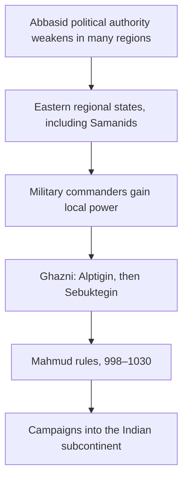

# The missing bridge: Abbasids to regional powers

Previous: [[04. Umayyads and the Road to Sindh]] · Next: [[06. Ghazni to Ghor to Delhi]]

## 750 does not mean that Islam started again

The **Abbasid revolution** replaced the Umayyad ruling house in the central caliphate. It was a change of dynasty. A surviving Umayyad branch subsequently ruled in Spain.

Under the Abbasids, the political centre shifted towards Iraq. **Al-Mansur founded Baghdad in 762**. Thus Baghdad was not Muhammad’s capital or Qasim’s imperial capital. Qasim’s expedition had taken place roughly fifty years earlier.

**750–1258** is the conventional span of the Abbasid caliphate in Iraq. Do not read this as five centuries of equally strong rule over all Muslim lands. [The Met: Abbasid period](https://www.metmuseum.org/essays/the-art-of-the-abbasid-period-750-1258).

## How could there be a caliph and a sultan at the same time?

Imagine a distant governor who collects revenue and commands an army. If central authority weakens, his successors may become effectively independent. They might still seek the caliph’s recognition because it adds prestige and legitimacy.

This is an explanatory model, not a description of every province. In some places military commanders, local families or rival religious dynasties followed different paths.

**Political control and religious legitimacy could overlap without being identical.** Not all Muslim rulers recognized the same caliph.

## The eastern connection you need

**Khurasan** was a historical region spanning parts of present-day Iran, Afghanistan and Central Asia. **Transoxiana** lay beyond the Oxus/Amu Darya, associated especially with Bukhara and Samarkand.

The **Samanids** ruled in this eastern world and patronized Persian culture. Their court and military environment helped form the setting in which Turkic commanders rose. [The Met: Samanid background and Nishapur](https://www.metmuseum.org/it/essays/rare-coins-from-nishapur).

**Alptigin** established a base at Ghazni in **962**. **Sebuktegin**, ruling from **977**, strengthened the power from which the Ghaznavid dynasty developed. **Mahmud**, his son, secured the throne in **998**. Ghaznavid origins therefore have several milestones; “962” and “977” refer to different stages. [Iranica: Sebuktegin](https://www.iranicaonline.org/articles/sebuktegin/).

This is a chain of political developments, not a family tree of the caliphs.

## Arab, Persian and Turkic are different labels

- **Arab:** Qasim’s background and the early caliphates’ ruling milieu.
- **Persian:** a language and cultural tradition with strong influence on later courts and administration.
- **Turkic:** the background of the Ghaznavid founding military elite; it does not mean citizenship of modern Turkey.
- **Muslim:** a religious identity that can apply to people from all these backgrounds.

The Ghaznavids combined Turkic dynastic origins with a strongly Persianate court. Their state was based in the Afghanistan–Iran–northwest India region. [Iranica: Ghaznavids](https://www.iranicaonline.org/articles/ghaznavids/).

## Parallel events, not one worldwide succession

The Abbasid caliphs still existed during Mahmud’s reign and at the foundation of the Delhi Sultanate. Baghdad fell to the Mongols in **1258**; this did not end Muslim states elsewhere. The Delhi Sultanate already existed. [The Met: Abbasid decline and 1258](https://www.metmuseum.org/essays/the-art-of-the-abbasid-period-750-1258).
